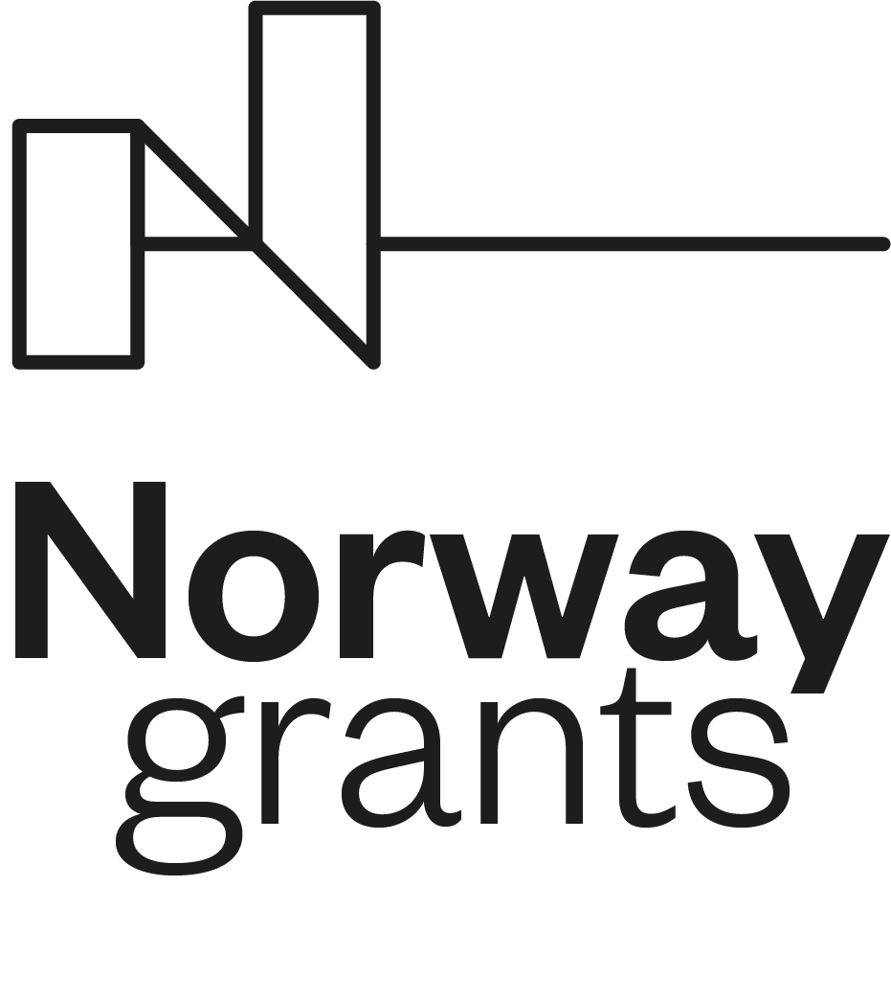

<a href="https://cr14.ee">
    
</a>
&nbsp;&nbsp;&nbsp;&nbsp;&nbsp;
<a href="https://eas.ee">
    
</a>
&nbsp;&nbsp;&nbsp;&nbsp;&nbsp;
<a href="https://taltech.ee">
    
</a>
&nbsp;&nbsp;&nbsp;&nbsp;&nbsp;
<a href="https://eeagrants.org">
    
</a>
&nbsp;&nbsp;&nbsp;&nbsp;&nbsp;
<a href="https://ntnu.edu">
    
</a>

# SDL Verifier WebAssembly

This Rust-based WebAssembly library provides a simple function to verify SDL (Schema Definition Language) text using the provided `Scenario` parsing and verification code. It is intended to be used in web applications for efficient client-side SDL validation.

## Features

- Validates SDL text using a Rust-based custom `Scenario` parser.
- Exposes a WebAssembly function for use in web applications.
- Optimized for small binary size and fast execution.

## Prerequisites

- [Rust](https://www.rust-lang.org/tools/install) (latest stable version)
- [wasm-pack](https://rustwasm.github.io/wasm-pack/installer/) (latest version)

## Usage

1. Clone this repository:

    ```sh
    git clone <https://github.com/Open-Cyber-Range/SDL-parser.git>
    cd wasm-sdl-parser
    ```

2. Build the project and generate the WebAssembly binary:

    ```sh
    wasm-pack build --target web --release
    ```

    This will create a `pkg` directory containing the WebAssembly binary and a JavaScript wrapper for the `parse_and_verify_sdl` function.

3. Integrate the generated files into your web application:

    ```html
    <script type="module">
    import init, { parse_and_verify_sdl } from './pkg/wasm-sdl-parser.js';

    async function main() {
        await init(); // Initialize the WebAssembly module

        const sdl_text = `
            name: test-scenario
            description: some-description
            start: 2022-01-20T13:00:00Z
            end: 2022-01-20T23:00:00Z
        `;

        try {
            const scenario_json = parse_and_verify_sdl(sdl_text);
            console.log(scenario_json);
        } catch (error) {
            console.log(error)
        }
    }

    main();
    </script>
    ```

    Replace the `sdl_text` variable with the SDL text you want to verify.

## Customization

If you need to customize the SDL validation logic, modify the `parse_and_verify_sdl` function in src/lib.rs.

## License

This project is licensed under the MIT License.
